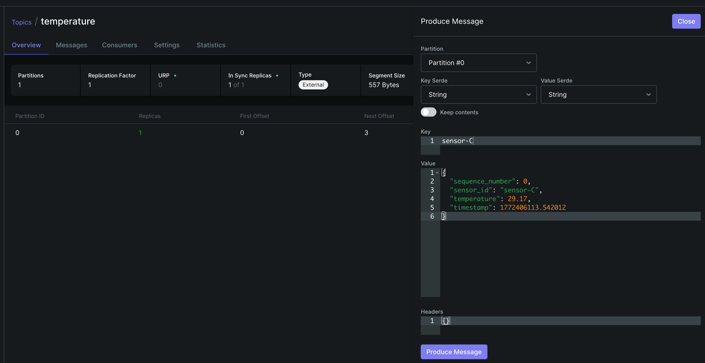

# Apache Airflow - Event-based DAG triggers

This repository contains an airflow DAG which triggers based on Kafka events.
Watch video demonstration here;
<video link here>

## Apache-Kafka setup
First you need to spin up Apache-kafka on your local machine. 
Use this docker-compose file to start kafka
https://github.com/maxcotec/apache-kafka/blob/main/kafka/docker-compose.yaml

```shell
cd kafka/
docker-compose up
```

Once Kafka and kafka-ui is up, go to http://localhost:8081
create a new topic `temperature` with partition `1`. 

## Apache-Airflow setup
Run following commands on your repository root directory;
```shell
mkdir airflow_home 
export AIRFLOW_HOME="$(pwd)/airflow_home"
export AIRFLOW__CORE__PLUGINS_FOLDER="$(pwd)/plugins"
export AIRFLOW__CORE__DAGS_FOLDER="$(pwd)/dags"
export AIRFLOW__CORE__LOAD_EXAMPLES=False
export AIRFLOW_CONN_KAFKA_DEFAULT='{
  "conn_type": "kafka",
  "extra": {
    "bootstrap.servers": "localhost:9092",
    "group.id": "group_1",
    "security.protocol": "PLAINTEXT",
    "enable.auto.commit": false,
    "auto.offset.reset": "beginning"
  }
}'
```

## create venv

```shell
uv venv .venv 
source .venv/bin/activate 
uv pip install -r pyproject.toml
```

Run bare-minimal airflow
```shell
python -m airflow standalone
```
This should spin up Apache-Airflow using sqlite database and Sequencial executor. 
Go to http://localhost:8080 to video airflow dashboard. 
Username: admin
password: located under `airflow_home/simple_auth_manager_passwords.json.generated`

## Test DAG

Once you have kafka and airflow up and running, its time to test the DAG. 
make sure your DAG is visible on dashboard and turned `ON`. 
Now sent a kafka message on topic `temperature`. You can do this from kafka-ui portal


```shell
key: sensor-C
value: 
{
  "sequence_number": 0,
  "sensor_id": "sensor-C",
  "temperature": 29.17,
  "timestamp": 1772406113.542012
}
```

Or you can use the provide script here
https://github.com/maxcotec/apache-kafka/blob/main/main/with_key/producer.py

to produce messages on your local kafka instance. 

